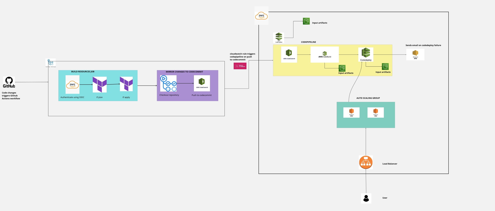
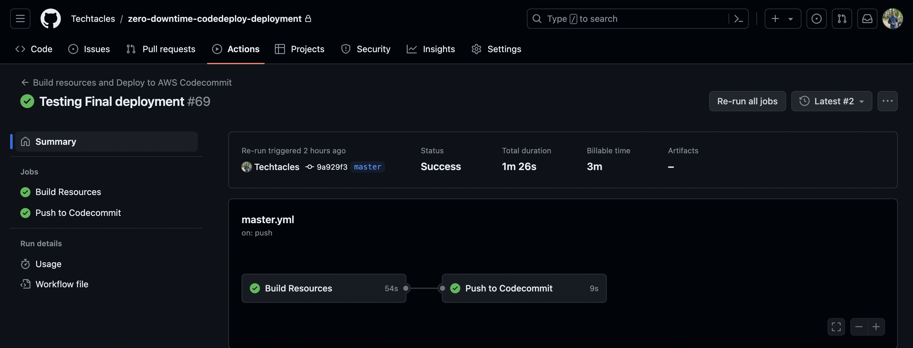
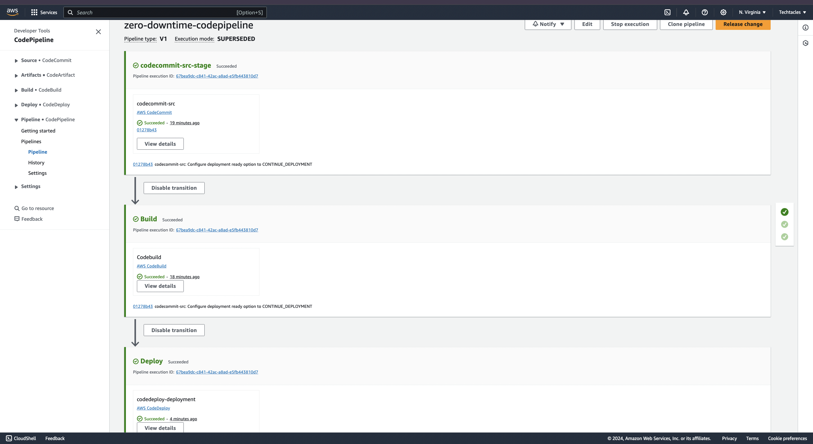
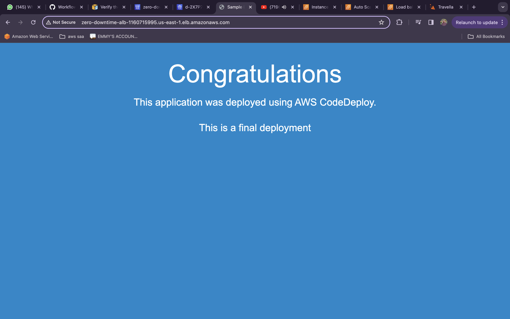

# zero-downtime-codedeploy-deployment
This repo demonstrates a robust cicd zero downtime deployment pipeline.

**Architecture**

In the architecture above, we have two CICD pipelines. The source code is in Github. The first CICD pipeline is Github Actions. It has two jobs. The first job builds the resources and the second job pushes to codecommit. The build job  checks out the repository, authenticates to AWS using OIDC, runs terraform fmt, terraform plan and terraform apply. This builds 
the aws resources and modules used in this project. The second job mirrors the code in Github and pushes it to a repository in AWS CodeCommit. 

We also have a second CICD pipeline on AWS. We have a cloudwatch rule which triggers AWS Codepipeline on code changes to AWS Codecommit. We have a codebuild which performs some tests , creates build artifacts in S3 and passes the build artifacts to Codedeploy. Codedeploy deploys the latest changes to the internet facing application running on our load balancer. 

This is a high level workflow of how the end to end architecture is. 

**Github Actions job**

**Codepipeline**

**Final Deployment**

**Folder Explanation**
.github/workflows: This contains the CICD jobs and stages for Github Actions. It contains the job for building the resources and the job for pushing to codecommit.

app_code: This contains the html file that was used for testing the deployment

infrastructure: This contains all the terraform modules and resources.

scripts: This contains all the scripts that was used such as the userdata.sh for our ec2 instances, deployment scripts which the appspec.yml uses for codedeploy, buildspec.yml for codebuild etc.

**Conclusion**
Further improvements will be made at a latter time. I'd appreciate any feedbacks or comments.
